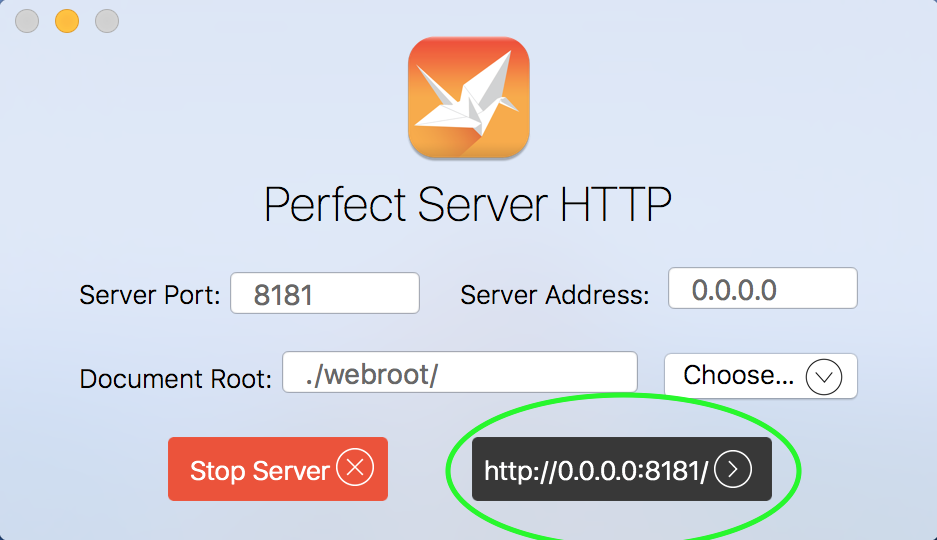

# Authenticator
This example creates a simple user registration and login system. Users can either create new accounts or login with their previous username and password. The example shows how the internal handler code can operate and serve for both web, using HTML, and mobile, using JSON. The same work-flow is presented to the user regardless of which interface being used.

To use the example, run the **Authenticator Server** target. This will launch the **Perfect Server HTTP** app. To run the iOS client app, launch the **Authenticator Client** target. To access the example with a web browser, click the "open in browser" button as show below.

Note that the server will eradicate the registration database on each launch. Therefore, the user that you register on one run will not exist on subsequent runs.