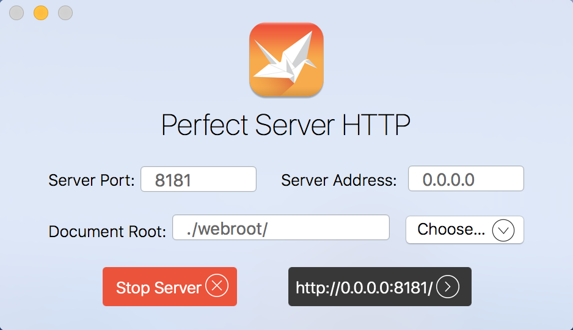
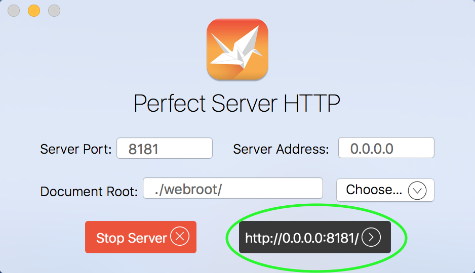

# Perfect Examples


These examples illustrate how Xcode projects which use Perfect are organized and how the clients and servers are run and debugged. Each example aims to show a different aspect of how Perfect operates with the goal of getting developers up to speed and creating their own server solutions.

* [Getting Started](#getting-started)
* [Tap Tracker](#tap-tracker)
* [Upload Enumerator](#upload-enumerator)

## Getting Started
After cloning the repository or downloading and expanding the zip file, navigate to the Examples directory and open the Examples.xcworkspace file. Each of the example projects consist of a target for an iOS mobile app and a corresponding server module. Each server module is associated with the **Perfect Server HTTP App** permitting it to be launched directly from within Xcode. By default, the server will listen on localhost on port **8181** and each example iOS app will attempt to contact the local server on that port. If you need to change this port, it can be done in the settings for the HTTP App and in the source code for each iOS app.

Perfect Server HTTP Settings:



Example end point in source code:


## Example Apps
### Tap Tracker


The simplest example app is called Tap Tracker. The Tap Tracker iOS app presents a button to the user. When tapped, this button will transmit the user's current location to the server. The server will store this location and will return to the iOS app the location of the last user who tapped the button. The app will then show this location on a map view.

To execute this example from within Xcode, run the **Tap Tracker Server** target and then the **Tap Tracker** target using an iPhone device simulator of your choice. Ensure that both targets are running simultaniously and that the **Tap Tracker** iOS app is set to simulate your location. 


Additionally, make sure to choose "Allow" when the app requests that you permit it to use your location. If you receive an error stating that location services are not available, ensure that you have selected a location to simulate and restart the iOS Tap Tracker app.

#### Client Operations
1. `ViewController` starts location services and records the user's current location.
2. `ViewController` presents a single button for the user to tap.
3. When user taps the button the `ViewController.buttonPressed` function is called.
4. `ViewController.buttonPressed` formulates an HTTP POST request to the URL *http://localhost:8181/TapTracker* using standard iOS `NSMutableURLRequest` and `NSURLSession` functionality. This post request is very simple and consists merely of the user's latitude and longitude.
5. `ViewController` receives the JSON structured response data from the server and uses Perfect's `JSONDecode` class to break the data apart and extract the location and time information pertaining to the previous button tap.
6. The response's `lat`, `long` and `time` components are used to indicate the map coordinates on the subsequent map view.

#### Server Operations
1. The server module consists of two relevent files:
	* **TTHandlers.swift**, within which is the `PerfectServerModuleInit` function, which all Perfect Server modules must implement, and the `TTHandler` class, which implements the `PageHandler` protocol.
	* **TapTracker.moustache**, which contains the template for the JSON based response data.
2. When the **Tap Tracker Server** target is built in Xcode, it places the resulting product in a directory called **PerfectLibraries**. When the Perfect Server is launched, it will look in this directory, based on the current process working directory, and load all the modules it finds calling the `PerfectServerModuleInit` function in each.
3. `PerfectServerModuleInit` adds a page handler called "TTHandler", associating with it a closure which will be called to create an instance of the handler on-demand when it is needed to fulfill a request. This closure simply returns a new `TTHandler` instance.
4. In this example, the `PerfectServerModuleInit` function also creates a SQLite database for use in storing the button tap locations and times. It creates a very simple table storing the time, latitude and longitude of the users' button taps.
5. When a request comes in targetting the **/TapTracker** (or **/TapTracker.moustache**) URL, the server will parse the moustache file and run any moustache pragmas contained therein. This particular moustache template associates itself with the previously registered "TTHandler" by containing the following pragma at the beginning of the file: ```{{% handler:TTHandler}}```
6. The server will find "TTHandler" within its internal registry and instantiate the associated handler object; an instance of class `TTHandler`. (Note that the handler name and the class name do not have to match, although they do match for this particular example.)
7. The server calls the handler's `valuesForResponse` function, which is part of the `PageHandler` protocol, passing to it the request's `MoustacheEvaluationContext` and `MoustacheEvaluationOutputCollector` objects which contain all the information pertaining to the request. The return value of the `valuesForResponse` function is a Dictionary object populated with the keys and values used when processing the moustache template. The result of the template processing is the resulting data which will be sent back to the client.
8. The `TTHandler` handler searches in the SQLite database for the previous button tap data and, if available, will use it as the response to the client. If there are no existing tap data rows, the current tap location data will be returned.
9. The `TTHandler` handler pulls the POSTed `lat` and `long` values sent by the client and stores them, along with the current time, into the SQLite database.
10. Finally, the `TTHandler` handler uses the previously retrieved `lat`, `long` and `time` values to populate the Dictionary which will be used when completing the moustache template. It does this by storing the values into a Dictionary and storing that Dictionary into an Array which is then placed into the returned Dictionary under the "resultSets" key. This particular methodology of storing the results Dictionary into an Array is more convoluted than is required for this simple example, but it illustrates how a multi-row result would be returned to the moustache template. This is further explored in the following.

The content of the **TapTracker.moustache** file is as follows:

```
{{% handler:TTHandler}}{{!

	This is the moustache template file for the tap tracker example.
	
}}{"resultSets":[{{#resultSets}}{"time":"{{time}}","lat":{{lat}},"long":{{long}} }{{^last}},{{/last}}{{/resultSets}}]}
```

This template produces JSON data. The data is structured as an array of objects found under the "resultSets" key. Each object in the array has a "time", "lat" and "long" key. The final row (even though there is only one row in this example) in the array has a "last" key which permits the array of objects to be properly comma delimited whilst adhering to the "stateless" methodology of moustache templating.

Inside the handler, the data is placed into the resulting dictionary using the following code:

```
// The dictionary which we will return
var values = [String:Any]()
let timeStr = try ICU.formatDate(time, format: "yyyy-MM-d hh:mm aaa")
let resultSets: [[String:Any]] = [["time": timeStr, "lat":lat, "long":long, "last":true]]
values["resultSets"] = resultSets
return values
``` 

Above, one can see the server takes the raw time value and formats it as a string using the facilities provided by ICU. This, along with the lat and long values are placed in the dictionary which is used to complete the moustache template.

### Upload Enumerator
This example illustrates how to extract file upload information from a request. The project consists of only a server component which generates HTML that can be viewed in your browser.

The use the exmaple, run the **Upload Enumerator** target. This will launch the **Perfect Server HTTP** app. Then click the "open in browser" button as show below.



Clicking this button will open the server's default page in your preferred browser. You should see the following on your browser:


Select a file or two, enter in notes and submit the form. Your result should look something like the following:


#### Server Operations
1. The server module consists of two relevent files:
	* **UploadHandler.swift**, within which is the `PerfectServerModuleInit` function, which all Perfect Server modules must implement, and the `UploadHandler` class, which implements the `PageHandler` protocol.
	* **index.moustache**, which contains the template for the HTML based response data.
2. When the **Upload Enumerator** target is built in Xcode it places the resulting product in a directory called **PerfectLibraries**. When the Perfect Server is launched, it will look in this directory, based on the current process working directory, and load all the modules it finds calling the `PerfectServerModuleInit` function in each.
3. When the **Upload Enumerator** target is built in Xcode it also copies the **index.moustache** file into the directory named **webroot**. This permits the file to be treated as the default page for the site.
4. `PerfectServerModuleInit` adds a page handler called "UploadHandler", associating with it a closure which will be called to create an instance of the handler on-demand when it is needed to fulfill a request. This closure simply returns a new `UploadHandler` instance.
5. When a request comes in targetting the root of the server, the server will parse the **index.moustache** file and run any moustache pragmas contained therein. This particular moustache template associates itself with the previously registered "UploadHandler" by containing the following pragma at the beginning of the file: ```{{% handler:UploadHandler}}```
6. The server will find "UploadHandler" within its internal registry and instantiate the associated handler object; an instance of class `UploadHandler`.
7. The server calls the handler's `valuesForResponse` function, which is part of the `PageHandler` protocol, passing to it the request's `MoustacheEvaluationContext` and `MoustacheEvaluationOutputCollector` objects which contain all the information pertaining to the request. The return value of the `valuesForResponse` function is a Dictionary object populated with the keys and values used when processing the moustache template. The result of the template processing is the resulting data which will be sent back to the client.
8. The handler accesses the `WebRequest.fileUploads` property. This is an array containing one `MimeReader.BodySpec` object for each file which was uploaded. These `BodySpec` objects contain the following:
	* field name
	* file name
	* file size
	* file content type (as determined by the browser which submitted the file)
	* local temporary file name
	* the `File` object containing the locally written file data
9. The handler iterates over each uploaded file and stores the related information into a dictionary. These dictionary values will be utilized in the moustache template which constitutes the resulting HTML data.
10. The handler then iterates over all non-file related parameters which were submitted by the browser. The names and values for each parameter are placed in their own dictionaries. In the resulting template, both file and non-file related submissions will be shown.
11. Finally, the handler adds a dictionary item for the page "title" and returns the resulting dictionary from its `valuesForResponse` function.
12. The **index.moustache** template first iterates over the supplied `{{#files}}` elements, outputting each piece of uploaded file related data into a table. It then iterates over the non-file `{{#params}}` and prints them in a list. The resulting completed HTML data is then returned to the browser.


