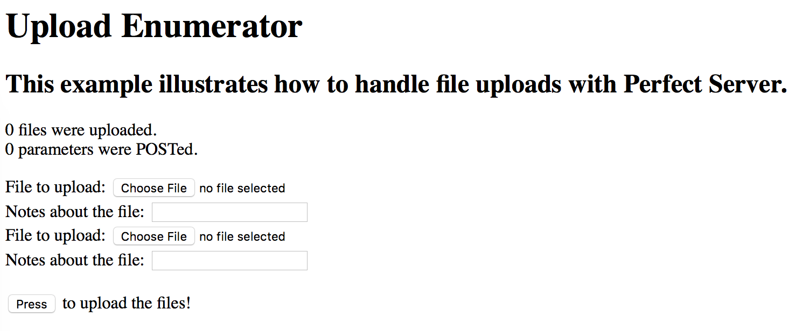
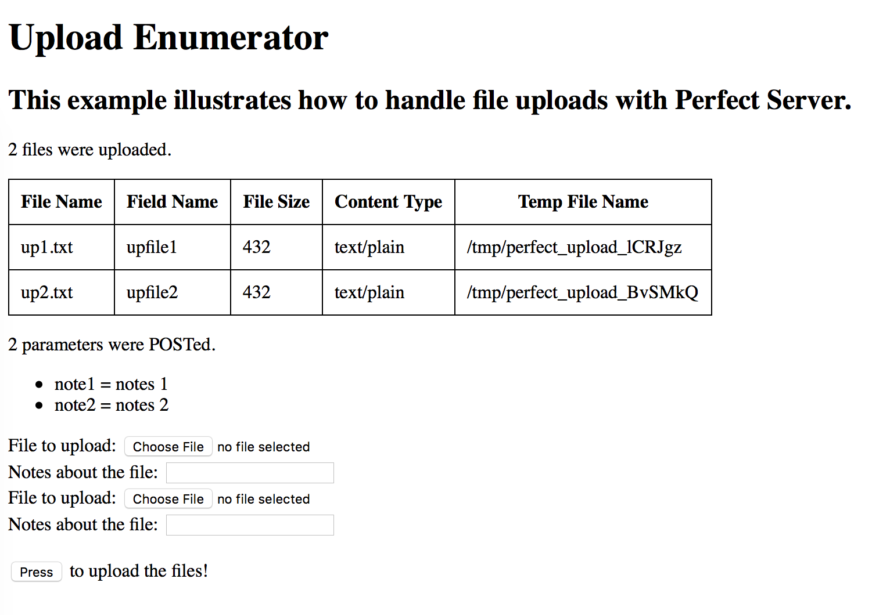

# Upload Enumerator
This example illustrates how to extract file upload information from a request. The project consists of only a server component which generates HTML that can be viewed in your browser.

To use the example, run the **Upload Enumerator** target. This will launch the **Perfect Server HTTP** app. Then click the "open in browser" button as show below.


Clicking this button will open the server's default page in your preferred browser. You should see the following on your browser:



Select a file or two, enter in notes and submit the form. Your result should look something like the following:



## Server Operations
1. The server module consists of two relevent files:
	* **UploadHandler.swift**, within which is the `PerfectServerModuleInit` function, which all Perfect Server modules must implement, and the `UploadHandler` class, which implements the `PageHandler` protocol.
	* **index.moustache**, which contains the template for the HTML based response data.
2. When the **Upload Enumerator** target is built in Xcode it places the resulting product in a directory called **PerfectLibraries**. When the Perfect Server is launched, it will look in this directory, based on the current process working directory, and load all the modules it finds calling the `PerfectServerModuleInit` function in each.
3. When the **Upload Enumerator** target is built in Xcode it also copies the **index.moustache** file into the directory named **webroot**. This permits the file to be treated as the default page for the site.
4. `PerfectServerModuleInit` adds a page handler called "UploadHandler", associating with it a closure which will be called to create an instance of the handler on-demand when it is needed to fulfill a request. This closure simply returns a new `UploadHandler` instance.
5. When a request comes in targetting the root of the server, the server will parse the **index.moustache** file and run any moustache pragmas contained therein. This particular moustache template associates itself with the previously registered "UploadHandler" by containing the following pragma at the beginning of the file: ```{{% handler:UploadHandler}}```
6. The server will find "UploadHandler" within its internal registry and instantiate the associated handler object; an instance of class `UploadHandler`.
7. The server calls the handler's `valuesForResponse` function, which is part of the `PageHandler` protocol, passing to it the request's `MoustacheEvaluationContext` and `MoustacheEvaluationOutputCollector` objects which contain all the information pertaining to the request. The return value of the `valuesForResponse` function is a Dictionary object populated with the keys and values used when processing the moustache template. The result of the template processing is the resulting data which will be sent back to the client.
8. The handler accesses the `WebRequest.fileUploads` property. This is an array containing one `MimeReader.BodySpec` object for each file which was uploaded. These `BodySpec` objects contain the following:
	* field name
	* file name
	* file size
	* file content type (as determined by the browser which submitted the file)
	* local temporary file name
	* the `File` object containing the locally written file data
9. The handler iterates over each uploaded file and stores the related information into a dictionary. These dictionary values will be utilized in the moustache template which constitutes the resulting HTML data.
10. The handler then iterates over all non-file related parameters which were submitted by the browser. The names and values for each parameter are placed in their own dictionaries. In the resulting template, both file and non-file related submissions will be shown.
11. Finally, the handler adds a dictionary item for the page "title" and returns the resulting dictionary from its `valuesForResponse` function.
12. The **index.moustache** template first iterates over the supplied `{{#files}}` elements, outputting each piece of uploaded file related data into a table. It then iterates over the non-file `{{#params}}` and prints them in a list. The resulting completed HTML data is then returned to the browser.
