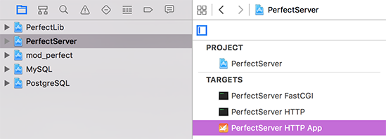

# Perfect Server

**Perfect Server** is the server-side component that makes Perfect tick. It is a stand-alone process which stays running and accepts connections from clients, processing requests and returning responses. It has a plugin mechanism for allowing developers to include their application logic modules, known as handlers, into the system. These handlers are associated with mustache templates which provide the response formatting mechanism. This methodology provides a clean separation of logic and presentation following the classic MVC architecture.

## Flavours

**Perfect Server** comes in two flavours; a FastCGI based version which ties into Apache 2.4 through [mod_perfect](../Connectors/mod_perfect/#mod_perfect), and a stand-alone HTTP server variant. The stand-alone HTTP version also includes a native OS X app which makes it very easy to start and configure a new instance. Any variant can be easily launched through Xcode permitting simultanious debugging of the client and the server.

Both server variants are implimented as their own classes, making it very easy to embed the servers in your own main Swift processes, or you can use the provided projects which generate Swift based executables.

## Linux Build Notes
First, ensure you have built [PerfectLib](../PerfectLib/#perfectlib).

* cd Perfect/PerfectServer
* make

This above will produce the *perfectserverfcgi* and *perfectserverhttp* executables. For ease of use you can symlink these into /usr/local/bin, if you like.

## Operations
When **Perfect Server** launches, it looks for various resources in particularly named directories located in the processes' current working directory. These directories are as follows:

* *PerfectLibraries* - This directory contains all the developer created handler modules. At startup, the server will dynamically load these modules and attempt to call a function within each named `PerfectServerModuleInit`. Within this function all handlers should be registered. Check the [Examples](../Examples/#examples) for a walkthrough on how this system operates.
* *SQLiteDBs* - Some facilities provided by Perfect Server utilize a local SQLite database for storage of temporary or configuration data (for example, the Sessions feature). This directory will be created automatically if it does not exist and any required databases will be generated as required.
* *webroot* - This directory is needed by the stand-alone HTTP server variant. Within this directory all web content will be sought. This includes any regular static content such as HTML or images, and any mustache templates.

### FastCGI
In order to use Perfect Server via [FastCGI](http://www.fastcgi.com/), you first need to build the [mod_perfect](https://github.com/PerfectlySoft/Perfect/tree/master/Connectors/mod_perfect#mod_perfect) Apache 2.4 module. The server itself is built with the "PerfectServer FastCGI" target. This produces the server executable which stays running and listens for connections from mod_perfect. The connections between mod_perfect and the Perfect Server occur over a UNIX style socket file. Perfect Server will create this socket file in its current working directory. mod_perfect must therefore know where this location is in order to connect. By convention, mod_perfect will look for this file one level up from the current Apache web server request's document root. For example, if your Apache virtual host's document root was configured as "/var/www/host1/webroot/" then Perfect Server must be started with the working directory of "/var/www/host1/". Consult the [mod_perfect](https://github.com/PerfectlySoft/Perfect/tree/master/Connectors/mod_perfect#mod_perfect) documentation for further configuration instructions and tips.

Beyond the above, internal operations between the FastCGI and HTTP server variants are the same. Both versions load your *PerfectLibraries* code modules in the same manner and the APIs for producing content are identical.

It's worth noting that while the protocol spoken between the Apache module and the Perfect Server is [FastCGI](http://www.fastcgi.com/), we have added an extension to the protocol which streamlines transferring file uploads (i.e. multi-part form data) between the two sides. This results in significantly improved transfer speeds compared to standard FastCGI. That said, this extension is optional and the Perfect Server should work with any standard FastCGI based web server module. However, our development efforts at this time are only focused on [mod_perfect](https://github.com/PerfectlySoft/Perfect/tree/master/Connectors/mod_perfect#mod_perfect) with Apache 2.4.

### HTTP
Write me.

### Deployment
Write me, too.